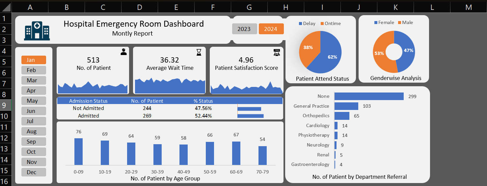
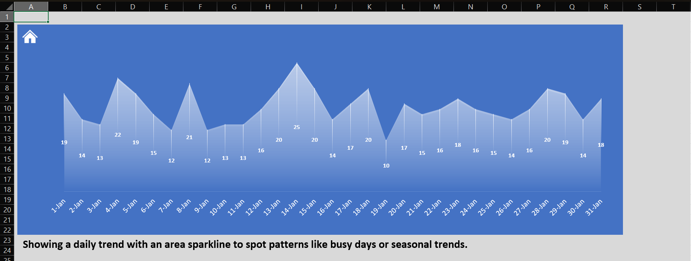
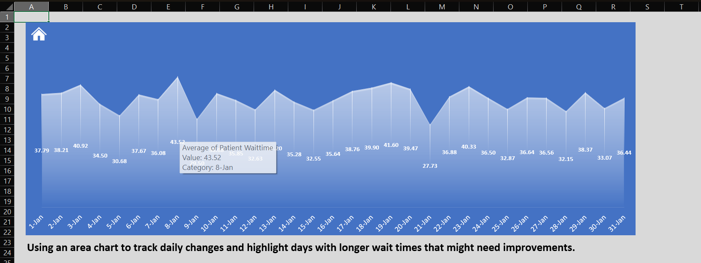
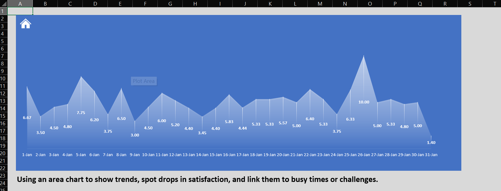

# 🏥 Hospital Emergency Room Dashboard

---

## **The Final Dashboard**

---

## **Dataset**
I have worked with **9217 rows** and **11 columns**.  
The columns are:  
- Patient Id  
- Patient Admission Date  
- Patient First Name  
- Patient Last Name  
- Patient Gender  
- Patient Age  
- Patient Race  
- Department Referral  
- Patient Admission Flag  
- Patient Satisfaction Score  
- Patient Waittime  

---

## **API Requirements**

### **Number of Patients**
- Count the total number of patients visiting the ER each day.  
- Show a daily trend with an area sparkline to spot patterns like busy days or seasonal trends.

### **Average Wait Time**
- Find the average time patients wait to see a medical professional.  
- Use an area sparkline to track daily changes and highlight days with longer wait times that might need improvements.

### **Patient Satisfaction Score**
- Check the average daily satisfaction score of patients to assess service quality.  
- Use an area sparkline to show trends, spot drops in satisfaction, and link them to busy times or challenges.

---

## **Data Processing**
Charts Created are — **Patient Admission Status:** Show how many patients were admitted vs. not admitted.  
**Patient Age Distribution:** Group patients by age.  
**Timeliness:** Measure the percentage of patients seen within 30 minutes.  
**Gender Analysis:** Display the number of patients by gender.  
**Department Referrals:** Check which departments patients are referred to the most.  

Made Calendar Table using Power Query:  
`= List.Dates(#date(2023,01,01),731,#duration(1,0,0,0))`  

**DAX Formula for Age Group:**  
`=IF([Patient Age]>=70,"70-79",IF([Patient Age]>=60,"60-69",IF([Patient Age]>=45,"45-59",IF([Patient Age]>=30,"30-44",IF([Patient Age]>=15,"15-29",IF([Patient Age]>=5,"05-14","0-4"))))))`  

**DAX Formula For Patient Attend Status:**  
`=IF([Patient Waittime]<30,"Within Time","Delay")`  

---

## **Area Chart for No of Patients**

---

## **Area Chart for Average Wait Time**

---

## **Area Chart for Patients Satisfaction Score**

---

## **Author**

**Ashutosh Sahoo**  
**Computer Science and Engineering**  
**Specialization:** Data Science and Analytics | IIIT Nagpur  
**Email:** [sahooashutosh792@gmail.com](mailto:sahooashutosh792@gmail.com)
